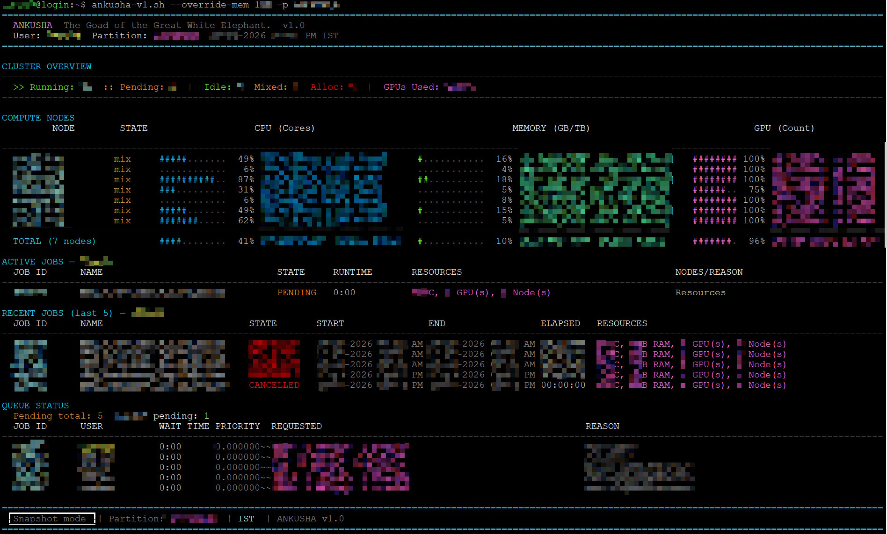
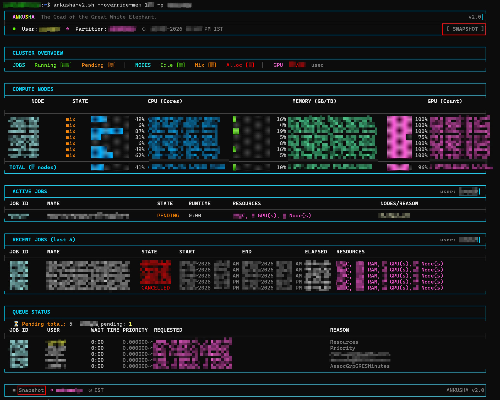
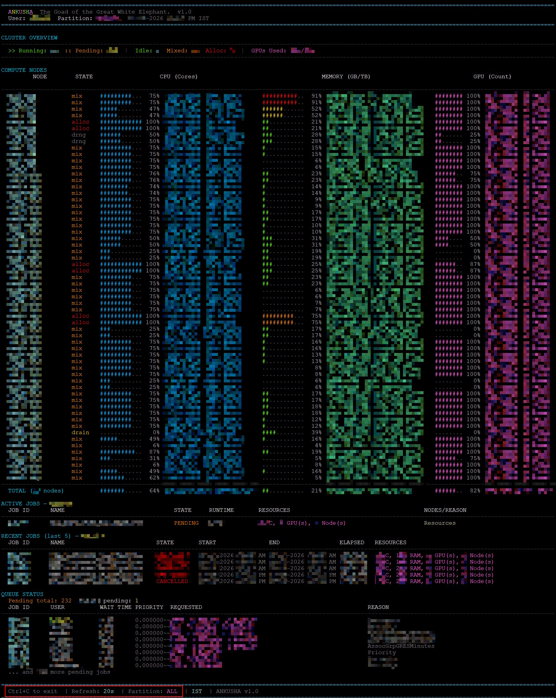
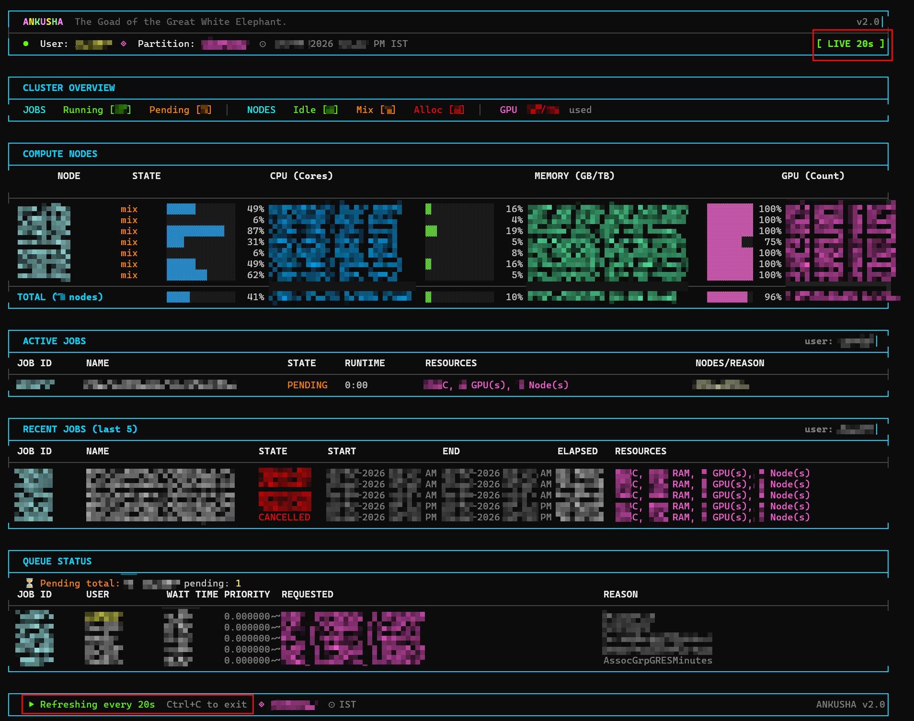
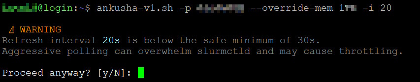
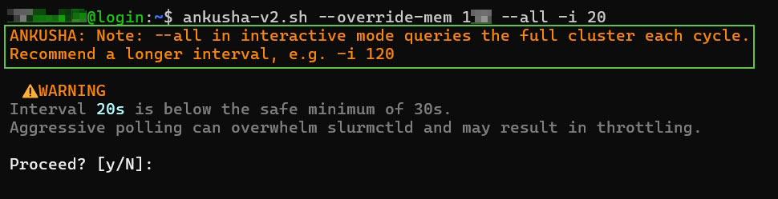

<div align="center">

<pre>
█████╗ ███╗ ██╗██╗ ██╗██╗ ██╗███████╗██╗ ██╗ █████╗
██╔══██╗████╗ ██║██║ ██╔╝██║ ██║██╔════╝██║ ██║██╔══██╗
███████║██╔██╗ ██║█████╔╝ ██║ ██║███████╗███████║███████║
██╔══██║██║╚██╗██║██╔═██╗ ██║ ██║╚════██║██╔══██║██╔══██║
██║ ██║██║ ╚████║██║ ██╗╚██████╔╝███████║██║ ██║██║ ██║
╚═╝ ╚═╝╚═╝ ╚═══╝╚═╝ ╚═╝ ╚═════╝ ╚══════╝╚═╝ ╚═╝╚═╝ ╚═╝
</pre>

### _The Goad of the Great White Elephant._

[](LICENSE)
[](#the-sacred-scrolls-requirements)
[](https://slurm.schedmd.com/)
[](#1-to-banish-the-curse-of-dependencies)
[](#2-to-uphold-the-sanctity-of-trust)
[](#audit-it-yourself)

<br>

A zero-dependency, terminal-native HPC manifestation.

A high-performance, safe Slurm monitoring dashboard. Pure Bash.

Designed to tame any mammoth in the world at **O(1)** Silence.

_**No browser. No server. No Python. No pip. No modules. Just Bash.**_


_**Zero Privilege. No root. No sudo.
A user-space Mahout for the HPC Mammoth.**_

</div>

---
## The Mahout's Mandala ☸️

<table>
  <tr>
    <td valign="center" width="300">
      
    </td>
    <td valign="top">
      <br>
      <ul>
        <li><b><a href="#what-is-ankusha-">⚡ What is ANKUSHA?</a></b> — Summon the dashboard without the curse of dependencies.</li>
        <li><b><a href="#glimpses-of-the-goad-in-action-">📸 Glimpses of the Goad in Action</a></b> — See the Classic Form and Modern Visage.</li>
        <li><b><a href="#the-goads-arsenal-features-at-a-glance-">✨ The Goad's Arsenal</a></b> — A quick summary of the Goad's powers.</li>
        <li><b><a href="#why-ankusha-exists-the-three-sacred-purposes-">🎯 The Three Sacred Purposes</a></b> — Why this goad was forged in pure Bash.</li>
        <li><b><a href="#the-sacred-scrolls-requirements-">📜 The Sacred Scrolls (Requirements)</a></b> — The ancient spirits that must be present.</li>
        <li><b><a href="#summoning-the-goad-">🚀 Summoning the Goad</a></b> — The ritual to bring ANKUSHA to life.</li>
        <li><b><a href="#the-mahouts-command-scroll-">📖 The Mahout's Command Scroll</a></b> — The incantations to guide the Goad.</li>
        <li><b><a href="#engraving-the-goad-the-mahouts-personal-mark-️">⚙ Engraving the Goad</a></b> — Adding your personal mark to the tool.</li>
        <li><b><a href="#the-kavacha-armor-security-architecture-️">🛡 The Kavacha (Armor)</a></b> — A security posture as impenetrable as divine mail.</li>
        <li><b><a href="#the-vedic-mathematics-of-o1-silence-">📊 The Vedic Mathematics of O(1) Silence</a></b> — How discipline spares the controller from the "Thundering Herd."</li>
        <li><b><a href="#the-avatar-selection-v1-mythical-vs-v2-modern-">🎨 The Avatar Selection</a></b> — Choosing between the Classic Mythical Form and the Modern Visage.</li>
        <li><b><a href="#the-origin-story-the-churning-of-the-silicon-ocean-">🐘 The Birth of the Goad</a></b> — How three alchemists forged a tool for a Nation's Peak.</li>
        <li><b><a href="#the-dharma-of-the-forge-contributing-">🤝 The Dharma of the Forge</a></b> — The sacred rules for those who wish to sharpen the blade.</li>
        <li><b><a href="#the-mahouts-pact-license-">⚖ The Mahout's Pact</a></b> — The universal law governing the Goad.</li>
      </ul>
       <br>
    </td>
  </tr>
</table>

---

## What is ANKUSHA? ⚡

**ANKUSHA** is a single-file Bash dashboard for [Slurm](https://slurm.schedmd.com/) HPC
clusters. It is not merely a script, but a manifestation—synthesising telemetry from
`squeue`, `sinfo`, `scontrol`, `sacct`, and `sprio` into one colour-coded,
terminal-width-aware screen. All with a **constant 10–11 Slurm calls per render**,
regardless of how many nodes your cluster has.

It operates entirely at the **user level**—no admin rights, no daemon installations, or
cluster configuration changes required. If you can whisper `squeue` to the scheduler, you
can command ANKUSHA.

- **Real-time GPU Tracking:** Monitor allocated vs. idle GPUs across your partition.
- **Zero-Dependency:** Runs on any restricted cluster (No Python/Conda needed).
- **Safe Monitoring:** Fixed call count ensures you never lag the `slurmctld` scheduler.

```text
ANKUSHA The Goad of the Great White Elephant. v2.0
● User: researcher  ◈ Partition: gpu  ⊙ 20-04-2026 02:47 PM IST  [ LIVE 30s ]
┌──────────────────────────────────────────────────────────────────────────────┐
│ CLUSTER OVERVIEW                                                             │
│  JOBS Running [12] Pending [5] │ NODES Idle [2] Mix [3] Alloc [9] │ GPU      │
│  48/56 used                                                                  │
├──────────────────────────────────────────────────────────────────────────────┤
│ COMPUTE NODES                                                                │
│  NODE             STATE   CPU ▓▓▓▓▓▓▓▓░░░░ 67% (172c/256c) [84c Free] ...    │
│  gpu-node-01      alloc   CPU ▓▓▓▓▓▓▓▓▓▓▓▓ 100% (256c/256c) [0c Free] ...    │
│  gpu-node-02      mix     CPU ▓▓▓▓░░░░░░░░  38% (96c/256c) [160c Free] ...   │
│  TOTAL (9 nodes)          CPU ▓▓▓▓▓▓▓▓░░░░  68% (688/1024c) [336c Free] ...  │
└──────────────────────────────────────────────────────────────────────────────┘
```

---

## Glimpses of the Goad in Action 📸

### v1 — Mythical - The Classic Form (Maximum Compatibility)

> _Full dashboard snapshot — dark terminal, 160 columns_
>
> 

### v2 — Modern - The Modern Manifestation (Unicode Box Drawing)

> _Full dashboard — `┌────┐` borders, `▓▓▓░░░` bars, pill-style overview_
>
> 

### Live Monitoring in Action

> _Interactive mode with 30-second refresh (default - Customizable) — showing real-time cluster changes_

**v1 (Mythical) - Live/Interactive/Refresh Mode:**


**v2 (Modern) - Live/Interactive/Refresh Mode:**


---

## The Goad's Arsenal (Features at a Glance) ✨

| Icon | Feature               | Detail                                                     |
| :--: | :-------------------- | :--------------------------------------------------------- |
|  🖥  | **Node Overview**     | Per-node CPU, RAM, GPU—colour-coded progress bars          |
|  🧠  | **Live Memory**       | RAM from Slurm `RealMemory`—never hardcoded                |
|  📋  | **Active Jobs**       | Running and pending with full resource breakdown           |
|  🕑  | **Job History**       | Last 5 completed jobs via `sacct`, from the last 7 days    |
|  🔢  | **Queue & Priority**  | Pending queue with `sprio` scores, colour-coded            |
|  ⚡  | **Snapshot Default**  | Renders once and exits—safe for scripting and `cron`       |
|  🔄  | **Interactive Mode**  | Live refresh with configurable interval (`-i [SECS]`)      |
|  🌍  | **Timezone Aware**    | `--tz` flag; IST by default; label auto-detected           |
|  🛡  | **10 Fixed Calls**    | Constant Slurm load regardless of cluster size             |
|  ⚠   | **Refresh Guard**     | Warns and requires `[y/N]` for intervals < 30s             |
|  🔒  | **Signal Safe**       | Top-level trap; cursor restored and sleep reaped on Ctrl+C |
|  🎨  | **Two Visual Styles** | Classic ASCII (v1) and Unicode box-drawing (v2)            |
|  📦  | **Zero Dependencies** | Pure Bash + Slurm CLI tools already on your system         |

---

## Why ANKUSHA Exists: The Three Sacred Purposes 🎯

While there are polished HPC monitors written in Python, Rust, and Go, ANKUSHA was
intentionally forged in pure Bash to fulfill three sacred duties that other tools cannot.

### 1. To Banish the Curse of Dependencies

In the hallowed halls of production HPC, a user is often shackled. Security policies
block `pip`. Module systems are fickle. Conda environments are forbidden luxuries.

**ANKUSHA requires no installation.** If you have a shell, you have a dashboard. Copy one
file. `chmod +x`. The ritual is complete.

### 2. To Uphold the Sanctity of Trust

In the digital realm, a binary is a black box. A Bash script is an open book.

- **Transparency:** A sysadmin can `cat ankusha.sh` and verify every Slurm call, every
  logic gate, every `eval`, in under five minutes. There is no obfuscation, no bytecode,
  no compiled mystery.
- **Zero Supply-Chain Risk:** No `pip install`, no `npm ci`, no `cargo build`. No
  transitive dependencies that could be poisoned by malevolent spirits upstream.
- **Portability:** It runs identically on a 15-year-old jump host and a modern
  head-node—free from the chaos of shared library conflicts or Python version mismatches.

### 3. To Avoid the Sin of the Naive Monitor

The common mantra of `watch squeue` is a simple sin, but a sin nonetheless. It hammers
the Slurm controller with redundant RPCs. When many users chant this mantra, the
`slurmctld` itself slows, and all suffer.

ANKUSHA walks the middle path: the **visual richness** of a compiled application with the
**lightweight footprint** of a native system utility—a feat achieved through
bulk-fetching, in-memory caching, and a constant call count that does not scale with
cluster size.

---

## The Sacred Scrolls (Requirements) 📜

| Tool                 | Purpose                       |  Required?  |
| :------------------- | :---------------------------- | :---------: |
| `bash` ≥ 4.0         | The language of the Goad      |     ✅      |
| `sinfo`, `squeue`    | Whispers to the scheduler     |     ✅      |
| `scontrol`           | Deeper inquiries to the nodes |     ✅      |
| `tput`               | The art of colour and light   |     ✅      |
| `awk`, `grep`, `sed` | The sacred text-carving tools |     ✅      |
| `sacct`, `sprio`     | Sages of history and destiny  | ⚪ Optional |

Fear not, Mahout. This is not a list of demands. These sacred tools are the ancient
spirits that already dwell within any Slurm-powered realm. We list them merely for the
sake of the unbeliever, as proof that no pilgrimage to the temple of `pip` is required.

**No Python. No Node.js. No Ruby. No Go. No browser. No pip. No conda.
No `module load`. No internet connection. No installation.**

---

## Summoning the Goad 🚀

```bash
# Clone the forge
git clone https://github.com/PSaiSurya/Ankusha.git
cd Ankusha

# Grant power to the manifestations
chmod +x scripts/*.sh

# Choose your Avatar and summon immediately:
./scripts/ankusha-v1.sh -p your_partition    # Classic ASCII
./scripts/ankusha-v2.sh -p your_partition    # Modern Unicode

# --- OR: Place the Goad on your sacred PATH for daily ritual ---

# 1. Create your local shrine of binaries (if it doesn't exist)
mkdir -p ~/.local/bin

# 2. Copy your preferred Avatar to the PATH
# For the Classic experience:
cp scripts/ankusha-v1.sh ~/.local/bin/ankusha

# For the Modern experience:
cp scripts/ankusha-v2.sh ~/.local/bin/ankusha

# Or keep both with distinct names:
cp scripts/ankusha-v1.sh ~/.local/bin/ankusha-classic
cp scripts/ankusha-v2.sh ~/.local/bin/ankusha-modern

# 3. Ensure the shrine is recognized by your shell
# (Only needed once; check your ~/.bashrc if unsure)
export PATH="$HOME/.local/bin:$PATH"

# The Goad now answers to your call from any pasture
ankusha --help                    # If you chose one version
ankusha-classic --help           # If you kept both
ankusha-modern --help            # If you kept both
```

### Quick Start Examples

```bash
# Snapshot of default partition
ankusha

# Live monitoring of GPU partition, 60-second refresh
ankusha -i 60 -p gpu

# View alice's jobs across all partitions
ankusha --all -u alice

# Monitor with custom timezone
ankusha -i 30 --tz UTC
```

---

## The Mahout's Command Scroll 📜

The Command Scroll is your quick reference to the powerful incantations (command-line options) that direct ANKUSHA's gaze.

```bash
ankusha                         # Glimpse the default pasture, your own herd
ankusha -p gpu                  # Glimpse the 'gpu' pasture
ankusha -p highmem -u alice     # Observe the herd of the mahout 'alice'
ankusha -i                      # Begin the Watchful Meditation (30s refresh)
ankusha -i 60 -p gpu            # Meditate upon 'gpu' (60s refresh)
ankusha -i 10                   # A rapid meditation (warns, asks for intent)
ankusha --all                   # Gaze upon all pastures of the realm
ankusha --tz UTC                # See time through the lens of the Prime Meridian
ankusha --override-mem 1TB      # When Slurm forgets the elephant's true weight
ankusha --override-mem 512GB -p gpu  # Override memory, focus on 'gpu' pasture
ankusha --help                  # Unfurl the full command scroll
```

> **📖 Note on Memory Override:**  
> Some clusters report only `FreeMem` accurately while `RealMemory` may be misconfigured.  
> Use `--override-mem` to manually set the true total memory per node.  
> Accepts: `1TB`, `1024GB`, or raw MB values like `1048576`.

If the runes on this scroll prove cryptic, a more detailed scripture can be summoned directly from the Goad with `ankusha --help`.

---

## Engraving the Goad: The Mahout's Personal Mark ⚙️

A Mahout knows their beast, and a master knows their tools. While ANKUSHA is forged ready for any cluster, you may engrave it with your own preferences. All defaults are defined as read-only variables at the top of the script.

```bash
# --- THE TRIMMINGS (Change these for your own amusement) ---
readonly TOOL_NAME="ANKUSHA" # ← Go ahead. Rename it "Tusk-Tickler" or "Bob-Script".
                             # The Great Elephant will not judge your lack of poetry.
readonly TOOL_TAGLINE="The Goad of the Great White Elephant." # ← Or: "I swear to the Sysadmin I am not a DoS attack."
readonly VERSION="1.0" # ← Stay humble. The path to v9.0 is paved with hubris.

# --- THE ESSENTIALS (Truly useful engravings) ---
readonly DEFAULT_PARTITION="gpu" # ← Set this to the primary grazing grounds of your compute herd.
readonly DEFAULT_REFRESH=30 # ← The 'Sweet Spot'. 30s keeps the Admins' spirits calm.
readonly MIN_SAFE_REFRESH=30 # ← Crossing this line summons the "Are you certain?" spirit guide.
                             #   Note: this guard applies to interactive mode only. If you use
                             #   snapshot mode in a cron job, ensure your cron interval is also
                             #   >= 30s to avoid burdening slurmctld.
readonly DEFAULT_TZ="Asia/Kolkata" # ← Set to "UTC" or "America/New_York" for global mahouts.

```

---

## The Kavacha (Armor): Security Architecture 🛡️

In the theatre of computation, trust is not given; it is proven. ANKUSHA's armor is forged from principles of absolute minimalism.

### Zero Attack Surface

| Attack Surface                         |  Status  |
| :------------------------------------- | :------: |
| External packages (pip, npm, cargo)    | ❌ None  |
| Compiled or binary components          | ❌ None  |
| Network connections at runtime         | ❌ None  |
| Write operations to the filesystem     | ❌ None  |
| Root or elevated privileges            | ❌ Never |
| Hardcoded credentials or tokens        | ❌ None  |
| External API calls or hidden telemetry | ❌ None  |

### The One `eval` — An Inspected Join

A true Kavacha has no chinks. Therefore, let us inspect the one join in this armor. Both scripts contain exactly **one** `eval`. This is a standard, safe Bash idiom for returning multiple values from a subshell. The awk program produces a fixed-format string of integers. The output is validated against a strict integer pattern before `eval` ever sees it. No user input or external data ever reaches it, making it immune to injection.

### Signal Safety and Clean Exit

The trap for `SIGINT`, `SIGTERM`, `SIGHUP`, and `EXIT` is registered at the top level of both scripts, before `main()` is called. This guarantees that Ctrl+C at any point in execution — including during argument parsing and partition validation — will always restore the cursor, reset terminal colours, and reap the background sleep child before exiting. No ghost processes. No hidden cursor. No corrupted terminal state.

### Fast Refresh Protection

ANKUSHA includes built-in safeguards against aggressive polling that could burden the scheduler:

> _Warning dialog when attempting refresh intervals below 30 seconds and/or using --all to view all partitions in interactive mode_





> Both these protection apply to both Avatar forms and requires explicit user confirmation before proceeding.

### Audit It Yourself

```bash
# Read every line of the scripture before use
cat ankusha-v1.sh | less       # v1 Classic / Mythical
cat ankusha-v2.sh | less       # v2 Modern

# Find every eval in the codebase (there is one per script)
grep -n 'eval' ankusha-v1.sh ankusha-v2.sh

# Confirm zero calls to the outside world
grep -n 'curl\|wget\|nc\|ncat\|/dev/tcp' ankusha-v1.sh ankusha-v2.sh

# Let the static analysis sage inspect their purity
shellcheck ankusha-v1.sh ankusha-v2.sh
```

Both Avatar forms (`ankusha-v1.sh` and `ankusha-v2.sh`) share identical security properties — only their visual presentation differs. Verify the integrity of the manifestation by comparing the scripts against the `SHA256SUMS` provided in the latest release.

---

## The Vedic Mathematics of O(1) Silence 📊

> **The O(1) Principle:** While naive scripts burden the controller with a chaotic `O(N)`
> ritual, ANKUSHA remains unshakeable. It maintains a strict **10-call discipline**,
> ensuring the Cloud Mammoth never feels the weight of its rider—no matter how many tusks
> (nodes) the beast possesses.

### The Anatomy of Every Render

Every single render — snapshot or interactive frame — makes exactly the following Slurm
calls. This count is fixed. It does not grow with cluster size.

| Section                    | Slurm Tool | Purpose                                   | Calls  |
| :------------------------- | :--------- | :---------------------------------------- | :----: |
| `load_node_cache`          | `sinfo`    | Get node list for partition               |   1    |
| `load_node_cache`          | `scontrol` | Bulk-fetch all node metrics in one RPC    |   1    |
| `draw_quick_stats`         | `sinfo`    | Count node states (idle/alloc/mix/down)   |   1    |
| `draw_quick_stats`         | `squeue`   | Count + GPU usage for running jobs        |   1    |
| `draw_quick_stats`         | `squeue`   | Detailed pending jobs (count derived)     |   1    |
| `draw_nodes_section`       | `sinfo`    | Stream node list with state for rendering |   1    |
| `draw_jobs_section`        | `squeue`   | Fetch all active jobs in one call         |   1    |
| `draw_recent_jobs_section` | `sacct`    | Fetch last 7 days of completed jobs       |   1    |
| `draw_queue_section`       | `sprio`    | Fetch priority scores for pending jobs    |   1    |
| **Total**                  |            |                                           | **10** |

> GPU totals in `draw_quick_stats` are computed directly from `NODE_CACHE` (already in
> memory from `load_node_cache`) — no additional Slurm call required.
>
> Pending job data is fetched once in `draw_quick_stats` and reused in `draw_queue_section`
> — no duplicate queries.
>
> `sacct` and `sprio` are optional. If unavailable, those sections degrade gracefully
> and their calls are skipped, reducing the total to **8 calls per render**.

### Karmic Relief: The Impact of O(1) Discipline

| Cluster Magnitude | The Naive Clamour  | The ANKUSHA Silence | Scheduler Relief |
| :---------------- | :----------------: | :-----------------: | :--------------: |
| **10 Nodes**      |  34 calls/render   | **10 calls/render** |   71% Quieter    |
| **50 Nodes**      |  114 calls/render  | **10 calls/render** |   91% Quieter    |
| **100 Nodes**     |  214 calls/render  | **10 calls/render** |   95% Quieter    |
| **512 Nodes**     | 1,038 calls/render | **10 calls/render** |  99.0% Quieter   |

_Audit basis: static analysis of `ankusha-v1.sh` source. Naive baseline = `14 + 2N`
calls (one `squeue` per node for state, one `sinfo` per node for metrics). ANKUSHA
baseline = 10 fixed calls regardless of N. Relief = `(naive − 10) / naive × 100`._

---

## The Avatar Selection (v1 Mythical vs v2 Modern) 🎨

A Mahout must choose the form of their Goad. Both Avatars share the same soul and
identical logic.

|                        | `ankusha.sh` — v1 Mythical     | `ankusha2.sh` — v2 Modern        |
| :--------------------- | :----------------------------- | :------------------------------- |
| **Progress bars**      | `####....` ASCII fill          | `▓▓▓░░░` Unicode block elements  |
| **Section borders**    | `────────` separator lines     | `┌────┐` box-drawing frames      |
| **Best for**           | PuTTY, TTY, xterm, MobaXterm  | iTerm2, Windows Terminal, Kitty  |
| **Slurm Call Count**   | **10 per render**              | **10 per render**                |
| **Signal Safety**      | Top-level trap, sleep tracked  | Top-level trap, sleep tracked    |
| **Partition Validation** | `scontrol ping` + partition check | `scontrol ping` + partition check |

---

## The Origin Story: The Churning of the Silicon Ocean 🐘

In the ancient lore of the Vedas, the ocean of milk was churned to reveal a pristine,
multi-tusked white elephant—a celestial mount capable of carrying the heavens.

In our modern age, a new ocean was churned: an ocean of petabytes, qubits, and
floating-point operations. From this digital churning emerged the **"Cloud Mammoth"**—the
subcontinent's swiftest sovereign supercomputing peak and the Mythical White Elephant of
national science.

### The Tripartite Forge

Even a celestial beast needs a steady hand. To steer this national summit of compute, a
tripartite alliance of **Digital Alchemists** gathered to forge a tool worthy of the ride:

- 🧠 **The Mahout (The Human Architect)**: Defined the systems-security constraints and
  Slurm-safe batching protocols, field-tested on production national-scale hardware.
- ⚙ **Claude (The Anthropic Artisan)**: Provided the rigour of the script, ensuring
  every Bash line was as sharp and durable as a diamond-tipped tusk.
- ✨ **Gemini (The Google Visionary)**: Infused the interface with visual flair, adaptive
  layouts, and lore.

The result is **ANKUSHA** (_Sanskrit: अङ्कुश — the elephant goad_). It was forged not
merely as a script, but as a piece of mythology—born on a supercomputer to command any
cluster in the world with zero friction and zero load.

---

## The Dharma of the Forge (Contributing) 🤝

Contributions are welcome, but the Dharma of the Forge is strict and non-negotiable.

1. **Pure Bash only** — no new external dependencies, ever.
2. **Test on a real Slurm cluster** — not a mock or a container.
3. **Do not increase the fixed call count** — run the audit mentally before opening a PR.
4. **Update both v1 and v2** if logic changes — they share the same soul.
5. **Pass `shellcheck`** with zero warnings.
6. **Preserve signal safety** — the top-level trap and tracked `sleep` PID must remain
   intact. Never move the trap registration inside `main()`.

---

## The Mahout's Pact (License) ⚖

I chose the MIT License because a tool designed to guide a 1,000-tusked compute beast
shouldn't be held back by 1,000 lines of legalese. It is the "Universal Key" of the
open-source world.

While the law says you could technically scrub my name from the forge, we are both
scientists of the silicon. If **ANKUSHA** helps you tame your local mammoth:

- **Keep the Credits:** Let the "Synthetic Architects" (Claude & Gemini) and the Human
  Mahout keep their tiny corner of the script.
- **The "Karma" Star:** If this script saves your login node from a "Naive DoS" or helps
  you hit a paper deadline, toss a ⭐ to this repo. It's the only digital hay this
  elephant eats.

---

### The Mahout's Blessing 🐘

_In the realm of high-performance computation, let your logic be as swift as Garuda and
your uptime as eternal as the mountains. ANKUSHA was built so you could spend less time
debugging the scheduler and more time deciphering the universe._

<div align="center">

**Manifested through the tripartite spirit of The Mahout, Claude, and Gemini.**

Forged on 🐘 with 💖 by its First Mahout.

Designed to tame any Mammoth in the world.

</div>
